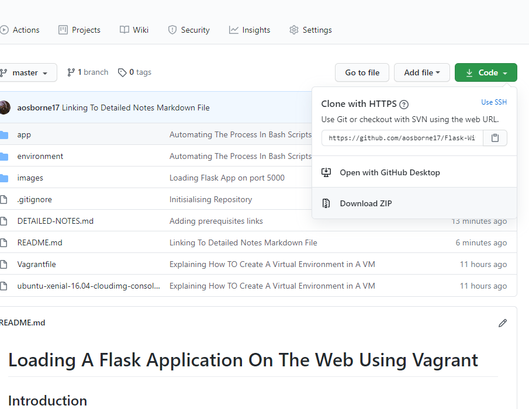
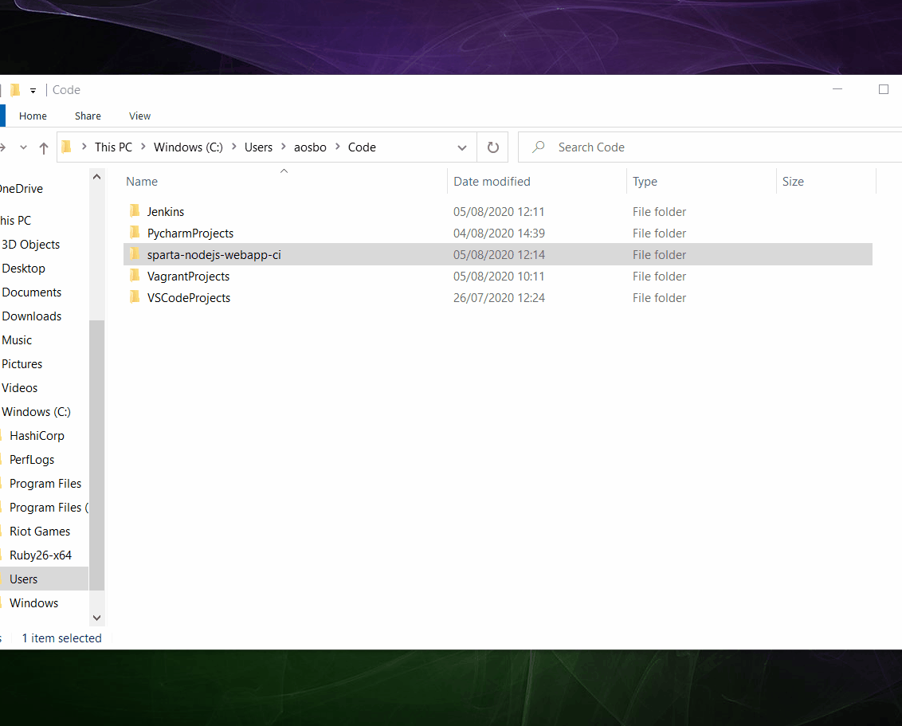

# Loading A Flask Application On The Web Using Vagrant

## Introduction
In this project we will use Mode View Controller To project our code onto a web browser, instead of running the app
within our Operating System, we will create a DEV environment using linux and run our Flask App here

For an in-depth explanation of the steps carried out, please refer to the detail-notes markdown file which is linked 
[Here](https://github.com/aosborne17/Flask-With-Vagrant/blob/master/DETAILED-NOTES.md
)
## Prerequisites
Please ensure you have the following software's downloaded

1. [Ruby](https://github.com/oneclick/rubyinstaller2/releases/download/RubyInstaller-2.6.6-1/rubyinstaller-devkit-2.6.6-1-x64.exe)
2. [Vagrant](https://releases.hashicorp.com/vagrant/)
3. [Virtual Box](https://www.virtualbox.org/wiki/Downloads)

As we are creating the Application inside our VM, there is no need to have python or flask downloaded locally

## Cloning The Repository
Clone the repository by clicking on the button displayed below, this will download a zip file onto your local PC



After we have extracted the folder and placed it in the folder we would like, we would then enter the folder
through git bash




## Prerequisite Check
Within the folder, run the below commands to ensure we have downloaded the correct versions of each software
- ```vagrant --version```
- ```ruby --version```


## Running the Virtual Machine

- Now that we are within the project folder, we will run the following command
```commandline
vagrant up
```

## Navigating To The Web Pages
Navigate to the application using the URL below, from here we have full fledged access to navigate to all pages
```commandline
http://flaskapp.local/
```